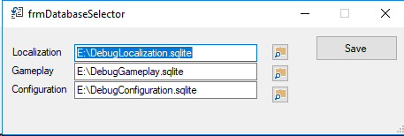
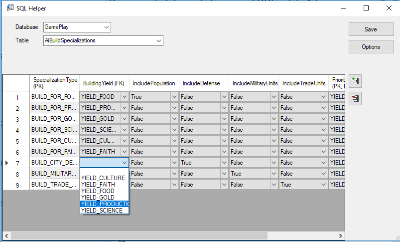
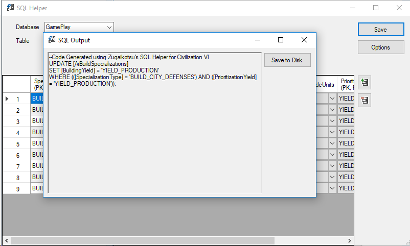
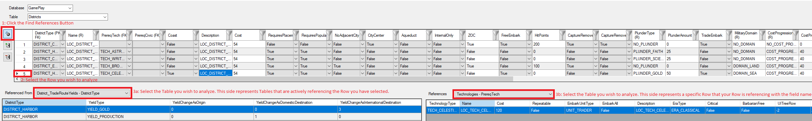

# SQL Helper for Side Meier's Civilization VI
## General
UI to Civilization VI database files to generate SQL based on items changed.

This project was developed originally in 2019 to assist with Civilization VI community by helping bridge the gap with SQL for handling with their mods. This project creates a UI to handle most of the logic in a clean and easy fashion.
This tool can be largley used without the need to worry about the complications, syntax, foreign keys, or required items. Because of this, this tool will likely be most useful for Beginners to Intermediate users of SQL, while Advance users will often prefer hand-crafted SQL statements, although it can be used by any experience levels.

## Installation
### GitHub
Install Visual Studio 2019 or above. Download the code from the GitHub repository. Open the solution, and then compile and run the project.

### Packaged Version
Extract, if applicable. Run the .msi to install the program. Run the application and follow the on-screen prompts. 

## Usage
Select the three Database files the program needs: DebugLocalization.sqlite, DebugConfiguration.sqlite, and DebugGameplay.sqlite by default. Save it to continue to the main screen navigation. Select your Database, and then your table to view the contents. The buttons on the right will allow for adding/deleting rows.
Once the table looks like what you want, press the Save, and it'll generate the SQL. You can then copy/paste or save the file to disk to be added into your mod.

### Load in your Configuration

### Modify the Tables to your Specifications

### Save Output for your Mod

### Handle Complex References

## Changelog
1.1.0: 05/05/2019 -- 
	-Added new Insert methods.
	-Cleaned up some issues where tables would sometimes disallow saving erroneously. 
	-Added "Referenced From" and "References" selectors for accessing the Foreign Keys easier.
	-All Columns in the main search now have the ability to be filtered down (the icon next to the column header).
	-Misc. Cleanup and optimizing. 
1.0.0: 03/21/2019 -- Initial Release

## Limitations
* Simple queries and SQL statements: Remove full tables or more complex edits can't be supported with this. 
* Works with the general GS install: Anything less can't be easily supported; anything more won't show, but shouldn't cause issues.

## License
This project is licensed under GPL-3. Refer to the [LICENSE](./LICENSE) for more details

This project is not created by, affiliated with or sponsored by Take-Two Interactive Software and its subsidiaries or its affiliates.